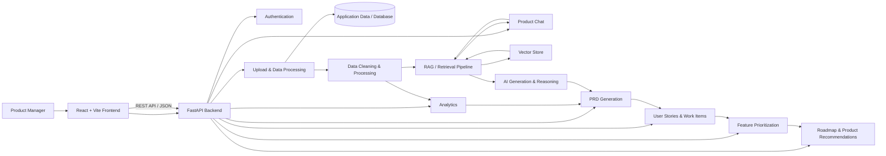

# 🤖 AI Product Manager Copilot

> An AI-powered Product Management Copilot that converts customer feedback and product data into actionable product insights, analytics, PRDs, prioritized user stories/work items, roadmap-oriented recommendations, and conversational product intelligence.

## 🎯 Project Overview

AI Product Manager Copilot is designed to reduce the manual work involved in turning unstructured customer/product information into product-management deliverables.

The application follows this high-level flow:

**Input Data → Upload & Processing → Analytics → Product Insights → PRD → User Stories & Work Items → Prioritization / Roadmap Insights → Product Chat**

The system keeps the frontend focused on the Product Manager experience while the FastAPI backend handles APIs, processing, persistence, analytics, AI/RAG workflows, and business logic.

---

## 🏗️ End-to-End Architecture



---

## 🖥️ Frontend

The frontend provides the main Product Manager workspace.

### Main frontend capabilities

- 📤 **Upload** customer feedback datasets
- 📊 **Analytics** for processed feedback
- 📄 **PRD generation and display**
- 👤 **User story and work-item generation**
- ⭐ **Priority-based story selection**
- 💬 **Product Chat** for product-related questions
- ⬇️ **Download generated PRDs and work items**
- 🔎 **Supporting retrieved feedback** for conversational answers
- ⚡ Responsive Vite development/build workflow

### Frontend technologies

| Technology | Purpose |
|---|---|
| React | Component-based user interface |
| Vite | Frontend development and production build |
| JavaScript / JSX | Application logic and UI |
| React Context | Application/session-level state where required |
| Recharts | Data visualization |
| Lucide React | UI icons |
| CSS | Application styling |
| REST API | Frontend ↔ backend communication |

### Frontend API integration

The frontend communicates with the FastAPI backend using HTTP requests.

Typical flow:

```text
React UI
   ↓
User action
   ↓
REST API request
   ↓
FastAPI endpoint
   ↓
Backend processing
   ↓
JSON response
   ↓
React UI update
```

Vite is configured for local development with the backend running on port `8000` and the frontend on port `5173`.

---

## ⚙️ Backend

The backend is implemented using **FastAPI** and exposes modular API routers.

### Main backend modules

```text
app.py
 ├── Authentication
 ├── Feedback
 ├── Upload
 ├── Analytics
 ├── Dashboard
 ├── PRD Generation
 ├── User Stories / Work Items
 ├── Feature Prioritization
 ├── Roadmap / Milestone Recommendations
 └── Product Chat
```

### Backend responsibilities

1. Accept product/customer data from the frontend.
2. Validate and process uploaded datasets.
3. Store application data.
4. Perform analytics and feedback analysis.
5. Retrieve relevant product context when required.
6. Generate product-management artifacts.
7. Prioritize features and work items.
8. Provide conversational product intelligence.
9. Return structured API responses to the frontend.

### Backend API areas

| Area | Responsibility |
|---|---|
| `/auth` | Authentication-related operations |
| `/upload` | Dataset upload and processing |
| `/feedback` | Feedback operations |
| `/analytics` | Feedback/product analytics |
| `/dashboard` | Dashboard data |
| `/prd` | PRD generation |
| `/user-story` | User stories and work items |
| `/prioritization` | Feature prioritization |
| `/milestone4` | Roadmap, milestone and product recommendation workflow |
| `/product-chat` | Product-focused conversational interface |

---

## 🧠 AI & RAG Workflow

The AI layer is used where product reasoning and generation are required.

```text
Customer/Product Data
        ↓
Cleaning & Pre-processing
        ↓
Text / Product Context
        ↓
Retrieval / RAG
        ↓
Relevant Context
        ↓
AI Reasoning / Generation
        ↓
Product Output
```

### RAG purpose

Retrieval-Augmented Generation helps the system ground product answers in the application's available feedback and product context instead of relying only on a generic model response.

The Product Chat workflow can therefore provide:

- Product issue identification
- Customer feedback-based answers
- Supporting feedback/context
- Product insight generation
- Evidence-oriented responses

---

## 📊 Product Intelligence Flow

### 1. Data Input

Product information can originate from sources such as:

- Customer feedback
- Reviews
- Support issues
- Feature requests
- Product usage/analytics data
- Internal product information

### 2. Data Processing

Uploaded information is cleaned and prepared for downstream processing.

Typical processing includes:

- File validation
- Data parsing
- Text cleaning
- Normalization
- Metadata handling
- Structured storage

### 3. Analytics

Processed information is analyzed to identify:

- Common issues
- Feedback patterns
- Product trends
- Priority signals
- Sentiment-related insights where supported
- Usage-related signals where available

### 4. Product Requirements

Insights can be transformed into a structured **Product Requirements Document (PRD)**.

### 5. Execution Planning

The PRD feeds the user-story workflow.

```text
PRD
 ↓
Functional Requirements
 ↓
User Stories
 ↓
Work Items
 ↓
Priority
 ↓
Roadmap / Milestone Recommendations
```

### 6. Product Chat

The Product Manager can ask questions about the available product information and receive answers supported by retrieved context.

---

## 🔗 How the Components Are Connected

```text
                    ┌──────────────────────┐
                    │   Product Manager    │
                    └──────────┬───────────┘
                               │
                               ▼
                    ┌──────────────────────┐
                    │ React + Vite         │
                    │ Product UI           │
                    └──────────┬───────────┘
                               │ REST / JSON
                               ▼
                    ┌──────────────────────┐
                    │ FastAPI Backend      │
                    │ API + Business Logic │
                    └───────┬───────┬──────┘
                            │       │
                ┌───────────┘       └─────────────┐
                ▼                                 ▼
       ┌─────────────────┐               ┌─────────────────┐
       │ Data / Database │               │ AI + RAG Layer  │
       └────────┬────────┘               └────────┬────────┘
                │                                 │
                ▼                                 ▼
       ┌─────────────────┐               ┌─────────────────┐
       │ Analytics       │               │ Retrieved       │
       │ & Insights      │               │ Product Context │
       └────────┬────────┘               └────────┬────────┘
                └────────────────┬────────────────┘
                                 ▼
                     ┌────────────────────────┐
                     │ PRD / Stories /        │
                     │ Prioritization /       │
                     │ Roadmap / Product Chat │
                     └────────────────────────┘
```

---

## 🛠️ Key Tools & Technologies

Only the core technologies used by the project are highlighted here.

### Frontend

- **React**
- **Vite**
- **JavaScript / JSX**
- **Recharts**
- **Lucide React**
- **CSS**

### Backend

- **Python**
- **FastAPI**
- **Uvicorn**
- **SQLAlchemy**
- **Pytest**

### AI / Data

- **RAG / Retrieval pipeline**
- **Vector-store based retrieval**
- **Data processing and analytics**
- **Embedding-based semantic retrieval**
- **AI-assisted product generation**

### Development & Quality

- **Git / GitHub**
- **GitHub Actions**
- **npm**
- **Python virtual environment**
- **REST APIs**
- **JSON**

> Docker configuration may exist in the repository, but the current CI workflow intentionally does **not** depend on Docker. Docker is therefore not part of the required CI validation path.

---

## 📁 Project Structure

```text
Ai-product-manager/
│
├── .github/
│   └── workflows/
│       └── ci-cd.yml
│
├── api/
│   ├── auth.py
│   ├── upload.py
│   ├── feedback.py
│   ├── analytics.py
│   ├── dashboard.py
│   ├── prd.py
│   ├── user_story.py
│   ├── prioritization.py
│   ├── product_chat.py
│   └── milestone4.py
│
├── database/
│   └── database.py
│
├── models/
│   ├── user_model.py
│   └── feedback_db.py
│
├── services/
│   └── application services
│
├── schemas/
│   └── API / data schemas
│
├── src/
│   ├── components/
│   ├── context/
│   ├── services/
│   ├── data/
│   ├── models/
│   ├── utils/
│   ├── App.jsx
│   ├── App.css
│   ├── index.css
│   └── main.jsx
│
├── tests/
│   ├── test_all.py
│   ├── test_api.py
│   └── database/API tests
│
├── app.py
├── package.json
├── package-lock.json
├── requirements.txt
├── vite.config.js
└── README.md
```

---

## 🔄 CI/CD Pipeline

The project currently uses **GitHub Actions** for automated CI validation.

The workflow runs on:

- Push to `main`
- Pull requests targeting `main`

### Pipeline

```text
Git Push / Pull Request
          │
          ├───────────────┐
          ▼               ▼
   Backend Tests    Frontend Build
          │               │
          │         npm ci
          │               │
     pip install     npm run lint
          │               │
       pytest        npm run build
          │               │
          └───────┬───────┘
                  ▼
          Pipeline Success
```

### Backend CI

- Ubuntu runner
- Python 3.11
- Dependency installation from `requirements.txt`
- Required Linux system dependencies
- `pytest -q`
- `PYTHONPATH=.`

### Frontend CI

- Ubuntu runner
- Node.js 22
- `npm ci`
- `npm run lint`
- `npm run build`
- Verification that `dist/` is generated

### Why CI matters

Every change submitted to the main branch can be automatically checked for:

- Backend test failures
- Frontend lint errors
- Frontend build failures
- Dependency/setup problems

This prevents broken code from being accepted without validation.

---

## 🚀 Local Setup

### 1. Clone the repository

```bash
git clone https://github.com/dhanujakarikalan/Ai-product-manager.git
cd Ai-product-manager
```

### 2. Backend setup

Create and activate a Python virtual environment.

Windows PowerShell:

```powershell
python -m venv venv
.\venv\Scripts\Activate.ps1
```

Install dependencies:

```powershell
pip install -r requirements.txt
```

Run the FastAPI backend:

```powershell
uvicorn app:app --reload --port 8000
```

Backend:

```text
http://127.0.0.1:8000
```

FastAPI documentation:

```text
http://127.0.0.1:8000/docs
```

### 3. Frontend setup

Install Node.js dependencies:

```powershell
npm ci
```

Start Vite:

```powershell
npm run dev
```

Frontend:

```text
http://localhost:5173
```

### 4. Verify the backend

Open:

```text
http://127.0.0.1:8000/
```

Expected response contains:

```json
{
  "status": "running",
  "version": "1.0.0"
}
```

---

## 🧪 Testing

Run backend tests:

```powershell
pytest -q
```

Run frontend lint:

```powershell
npm run lint
```

Build the frontend:

```powershell
npm run build
```

Preview the production frontend build:

```powershell
npm run preview
```

---

## 🔐 Configuration

Environment-specific and secret values should be stored in environment variables rather than committed to Git.

Use:

```text
.env
```

for local configuration and keep secrets out of source control.

A safe repository should never commit:

- API keys
- Database passwords
- Authentication secrets
- Private tokens
- Production credentials

---

## 📌 Current CI Scope

The current `main` branch CI validates the application code without requiring a local Docker installation.

```text
                GitHub Actions
                      │
          ┌───────────┴───────────┐
          ▼                       ▼
   Backend Validation       Frontend Validation
          │                       │
       pytest                 npm lint
          │                       │
          │                  npm build
          └───────────┬───────────┘
                      ▼
                 CI PASSED
```

Docker can be introduced later as a separate build/deployment stage without changing the application's core frontend/backend architecture.

---

## 🌟 Key Benefits

- Converts product feedback into actionable product outputs
- Reduces manual Product Manager effort
- Connects analytics with requirements generation
- Generates PRDs from analyzed product information
- Converts requirements into prioritized user stories/work items
- Supports roadmap and milestone-oriented product planning
- Provides contextual product Q&A through retrieval
- Separates frontend UI from backend business logic
- Uses automated CI checks for every main-branch change
- Provides a modular architecture that can be extended with additional product workflows

---

## 🔮 Future Enhancements

Potential next steps include:

- Production deployment automation
- Environment-specific configuration
- Containerized deployment
- Cloud-hosted database
- More advanced analytics dashboards
- Role-based access control
- Additional data-source connectors
- Observability and application monitoring
- Automated release/versioning workflow

---

## 📜 License

Add the project's selected license here before publishing a public production release.

---

## 👨‍💻 Project Summary

**AI Product Manager Copilot** brings together:

**React + Vite → FastAPI → Data Processing → Analytics → RAG/Retrieval → AI Product Generation → PRD → User Stories → Prioritization → Roadmap/Milestone Recommendations → Product Chat**

The architecture is intentionally modular so that the Product Manager experience can evolve without tightly coupling the UI to backend implementation details.
